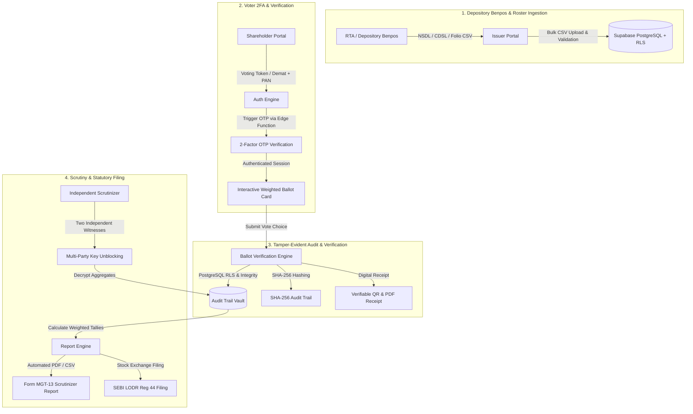

<div align="center">

  # 🗳️ Vote India Secure
  ### Enterprise E-Voting Platform for Indian Corporate Governance

  [](https://www.typescriptlang.org/)
  [](https://reactjs.org/)
  [](https://vitejs.dev/)
  [](https://supabase.com/)
  [](https://tailwindcss.com/)
  [](https://www.shareholdervoting.in/privacy-policy)
  [](https://www.shareholdervoting.in/compliance)
  [](https://www.shareholdervoting.in)

  <p align="center">
    <a href="https://www.shareholdervoting.in">Live Platform</a> •
    <a href="https://www.shareholdervoting.in/live-demo">Live Demo</a> •
    <a href="https://www.shareholdervoting.in/how-it-works">How It Works</a> •
    <a href="#-architectural-overview">Architecture</a> •
    <a href="#-statutory-compliance-matrix">Compliance</a> •
    <a href="#-key-features">Features</a> •
    <a href="#-local-development-setup">Setup Guide</a>
  </p>
</div>

---

## 📌 Executive Summary

**Vote India Secure** ([shareholdervoting.in](https://www.shareholdervoting.in)) is an enterprise-grade electronic voting SaaS engineered specifically for Indian corporate democracy. It empowers publicly listed corporations, unlisted enterprises, cooperatives, and Registrar & Transfer Agents (RTAs) to conduct seamless Annual General Meetings (AGMs), Extraordinary General Meetings (EGMs), and Postal Ballots.
 
Built from the ground up to replace cumbersome legacy workflows, the platform features SHA-256 tamper-evident audit hashing, scrutinizer digital unblocking workflows, instant **Form MGT-13** reporting, Section 103 Quorum tracking, multi-mode 2FA authentication, and strict architectural alignment with the **Companies Act 2013**, **SEBI (LODR) Regulations 2015**, and the **Digital Personal Data Protection (DPDP) Act 2023**.

---

## 🏛️ Architectural Overview



---

## ⚖️ Statutory Compliance Matrix

| Statute / Regulation | Statutory Mandate | Vote India Secure Architectural Implementation |
| :--- | :--- | :--- |
| **Companies Act 2013 — Section 108** | Mandatory e-voting facility for listed entities and companies with $\ge$ 1,000 shareholders. | Cloud-native multi-tenant e-voting architecture with unlimited concurrent voter throughput. |
| **Companies (M&A) Rules 2014 — Rule 20** | Operational timelines ($\ge$ 3 days remote voting, cut-off date $\le$ 7 days, 5:00 PM close). | Automated statutory timers, cut-off date validation, and immutable timestamped session locks. |
| **Rule 20(4)(xii) — Ballot Secrecy** | Register of votes cast cannot be accessed by company or third parties prior to unblocking. | AES-256 GCM ballot decoupling. Zero administrative access to voter choices before meeting unblocking. |
| **Rule 20(4)(xii) — Scrutinizer Unblocking** | Vault unblocked after meeting conclusion in presence of $\ge$ 2 independent witnesses. | Multi-witness digital key unblocking ceremony requiring co-signatory confirmation. |
| **Section 103 — Statutory Quorum** | Minimum quorum requirements for general meetings (5, 15, or 30 members based on size). | Built-in real-time Quorum Engine dynamically monitoring participant attendance against statutory tiers. |
| **Form MGT-13** | Statutory Scrutinizer's Report on remote e-voting and venue poll results. | One-click automated Form MGT-13 PDF report generation formatted to exact MCA standards. |
| **SEBI (LODR) 2015 — Regulation 44** | Listed entities must submit voting results to stock exchanges within 2 working days. | Real-time consolidated voting exports in structured Excel/CSV formats. |
| **DPDP Act 2023 (India)** | Purpose limitation, data minimisation, Indian data residency, and principal rights. | 100% sovereign Indian hosting (Mumbai/Bengaluru), PAN/DPID hash masking, DPO grievance redressal. |
| **CERT-In Directions (April 2022)** | Mandatory 180-day retention of cybersecurity telemetry and system logs. | Automated immutable audit trail logging with NTP time synchronization and 180-day retention. |

---

## ✨ Key Platform Features

### 🏢 Enterprise Issuer Portal (`/company-dashboard`)
* **Depository Benpos Ingestion:** Drag-and-drop ingestion of NSDL, CDSL, and physical folio registers with sample CSV template download and live tabular parsing preview.
* **Section 103 Quorum Engine:** Automated calculation of required quorum thresholds ($\le 1,000 \rightarrow 5$, $1,001-5,000 \rightarrow 15$, $> 5,000 \rightarrow 30$) with live attendance status tracking.
* **Resolution Builder & Timers:** Configure Ordinary and Special resolutions with statutory Section 102 explanatory notes and auto-closing remote voting windows.
* **Credential Dispatching:** One-click batch delivery of statutory AGM notices, Login IDs, and Security PINs via Supabase Edge Functions.
* **Roster Reporting:** Instant export of MCA-compliant PDF rosters and structured CSV registers.

### 👥 Shareholder Experience (`/shareholder-login`)
* **Dual-Mode 2FA Authentication:**
  1. *Voting User ID & PIN:* Direct electronic tokens dispatched by the company/RTA.
  2. *Demat & PAN Login:* Instant access using 16-digit Demat Account (NSDL/CDSL) or Folio Number + PAN verification.
* **Interactive Live Simulation Mode:** Instant 1-click test voter credentials (`/live-demo`) for shareholders and evaluators.
* **Cryptographic Balloting:** Cast weighted ballots in under 30 seconds with immediate cryptographic confirmation receipts and verifiable QR codes.
* **AI Resolution Briefing:** Instant executive summaries of lengthy annual reports and proxy materials powered by LLMs.

### 🛡️ Scrutinizer Digital Hub (`/live-demo` & `/voting-management`)
* **Multi-Witness Vault Unblocking:** Cryptographic key verification requiring the independent Scrutinizer and two external witnesses.
* **Automated MGT-13 Compilation:** Generates print-ready statutory Scrutinizer Reports with resolution breakdowns (Assent / Dissent / Abstain / Invalid).
* **Merkle Tree Audit Verification:** Independent mathematical verification of ballot ledger integrity.

### 🧠 AI Power Suite (Groq Llama 3.3 + Gemini)
* **Document Summarizer:** Condenses 200+ page corporate filings and notice agendas into clear, actionable bullet points.
* **AGM Q&A Sentiment Analysis:** Evaluates live shareholder questions to detect investor sentiment and core boardroom concerns.
* **VoteAssistant:** Intelligent floating chatbot assisting shareholders with procedural guidelines and statutory deadlines.

---

## 🛠️ Technology Stack

```text
┌────────────────────────────────────────────────────────────────────────┐
│                          FRONTEND APPLICATION                          │
│   React 18  •  TypeScript 5.5  •  Vite 5.4  •  Tailwind CSS  •  SSG   │
│   Radix UI Primitives  •  Lucide Icons  •  Recharts  •  i18next        │
└───────────────────────────────────┬────────────────────────────────────┘
                                    │ HTTPS (TLS 1.3)
┌───────────────────────────────────▼────────────────────────────────────┐
│                    SUPABASE SERVERLESS INFRASTRUCTURE                  │
│   PostgreSQL 15  •  Row-Level Security (RLS)  •  Deno Edge Functions   │
│   Resend Transactional Email  •  Groq Cloud AI (Llama 3.3)             │
└────────────────────────────────────────────────────────────────────────┘
```

---

## 📁 Project Directory Structure

```text
vote-india-secure/
├── .env.example                # Template for environment configurations
├── .gitignore                  # Git exclusion rules (SSG temp, audit dumps, OS files)
├── index.html                  # HTML entrypoint with optimized font loading & GTM
├── package.json                # Project dependencies and script commands
├── tailwind.config.ts          # Tailwind tokens, dark palette & typography
├── tsconfig.json               # TypeScript strict configuration
├── vercel.json                 # Vercel deployment, headers, and security rules
├── vite.config.ts              # Vite bundle chunking & SSG configuration
├── public/                     # Static assets, PWA manifest, robots.txt, sitemap.xml
│   ├── favicon-48x48.png       # High-res favicon
│   ├── logo-48.webp            # Optimized WebP brand logo
│   ├── manifest.json           # Progressive Web App manifest
│   ├── robots.txt              # Production search engine crawler directives
│   └── sitemap.xml             # XML sitemap covering all 31+ static routes
├── supabase/                   # Supabase database & serverless infrastructure
│   ├── supabase_setup.sql      # Core PostgreSQL schema, tables, and RLS policies
│   └── functions/              # Deno-based Supabase Edge Functions
│       ├── ai-ops/             # Groq AI summarization & sentiment analysis
│       ├── send-email-otp/     # 2FA OTP mailer via Resend
│       └── send-contact-message/ # Contact form webhook handler
└── src/                        # Application source code
    ├── main.tsx                # Client application bootstrap & SSG entry
    ├── App.tsx                 # Route registry & root layout providers
    ├── index.css               # Global CSS, Tailwind layers, font-family definitions
    ├── components/             # Reusable UI component library
    │   ├── 3d/                 # 3D interactive elements (OTPSuccess3D)
    │   ├── ai/                 # VoteAssistant chatbot & AI widgets
    │   ├── auth/               # AnimatedOtpVerification & ProtectedAdminRoute
    │   ├── company/            # Admin voting tables & Scrutinizer chart cards
    │   ├── home/               # HeroCyberOrb, StatsSection, Features, TrustBadges
    │   ├── layout/             # Navbar, Footer, SEO (Head manager), StructuredData
    │   └── ui/                 # Radix / Shadcn primitives (buttons, dialogs, tabs)
    ├── config/                 # App config & environment wrappers
    ├── hooks/                  # Custom React hooks (useToast, useTranslation)
    ├── i18n/                   # i18next configuration & JSON locales (en.json)
    ├── lib/                    # Core utilities & pdfReports generation engine
    ├── pages/                  # Top-level route views
    │   ├── Index.tsx           # Homepage with HeroCyberOrb & FAQPage JSON-LD
    │   ├── About.tsx           # Mission & E-E-A-T Governance Desk charter
    │   ├── Compliance.tsx      # Interactive SEBI & MCA compliance guide
    │   ├── LiveDemo.tsx        # Interactive voter & scrutinizer simulation
    │   ├── CompanyDashboard.tsx # Enterprise issuer dashboard with Benpos import & Quorum
    │   ├── ShareholderLogin.tsx # Dual-mode 2FA shareholder portal
    │   ├── blog/               # 6 Statutory corporate governance regulatory guides
    │   ├── legal/              # PrivacyPolicy (DPDP Act 2023), TermsOfService
    │   └── seo/                # Targeted SEO service pages (HowItWorks, AgmVoting, RemoteEVoting)
    └── types/                  # TypeScript interfaces and entity types
```

---

## 🚀 Local Development Setup

### Prerequisites
* **Node.js**: v18.0.0 or higher
* **npm**: v9.0.0 or higher
* **Git** installed on your machine

### 1. Clone the Repository
```bash
git clone https://github.com/Arunkumar30102006/SHAREHOLDER-VOTING-PLATFORM.git
cd vote-india-secure-main
```

### 2. Install Dependencies
```bash
npm install
```

### 3. Configure Environment Variables
Create a `.env` file in the root directory for frontend development:
```env
VITE_SUPABASE_URL=https://your-supabase-project.supabase.co
VITE_SUPABASE_ANON_KEY=your-supabase-anon-key
VITE_SUPABASE_PUBLISHABLE_KEY=your-supabase-publishable-key
VITE_SUPABASE_PROJECT_ID=your-project-id
```

Backend secrets must **never** be added to the frontend `.env`. Configure them in Supabase Edge Functions:
```bash
supabase secrets set RESEND_API_KEY="re_..."
supabase secrets set GROQ_API_KEY="gsk_..."
supabase secrets set OTP_HMAC_SECRET="your-64-character-hex-hmac-secret"
```

### 4. Start Local Development Server
```bash
npm run dev
```
Open [http://localhost:5173](http://localhost:5173) in your browser.

---

## 📜 Available Scripts

| Command | Purpose |
| :--- | :--- |
| `npm run dev` | Starts the Vite local development server with Hot Module Replacement (HMR). |
| `npm run build` | Builds the client bundle and static site pages via `vite-react-ssg`. |
| `npm run typecheck` | Runs strict TypeScript type-checking across all `.ts` and `.tsx` files. |
| `npm run lint` | Runs ESLint analysis across the codebase. |
| `npm run test` | Runs the automated unit and integration test suite. |
| `npm run verify` | Verifies build output HTML, JSON-LD schemas, images, and internal links. |
| `npm run preview` | Locally serves the production SSG build from `dist`. |

---

## 🌐 Production Deployment (Vercel)

The platform is optimized for **Vercel** with Static Site Generation (SSG):

1. Connect your GitHub repository to [Vercel](https://vercel.com).
2. Configure the project settings:
   - **Framework Preset:** `Vite`
   - **Build Command:** `npm run build`
   - **Output Directory:** `dist/client`
3. Configure environment variables in the Vercel Dashboard (`VITE_SUPABASE_URL`, `VITE_SUPABASE_ANON_KEY`).
4. Every push to `main` triggers automated static rendering, sitemap generation, and deployment.

---

## 🔒 Security & Vulnerability Disclosure

Security and ballot integrity are core to Vote India Secure. If you discover a potential vulnerability or security concern, please contact our security team:

* **Security & DPO Desk:** `support@shareholdervoting.in`
* **Response SLA:** Initial acknowledgment within 24 hours; technical triage within 72 hours.

---

## 📄 License & Legal Disclaimer

Copyright © 2026 **Vote India Secure** ([shareholdervoting.in](https://www.shareholdervoting.in)). All rights reserved.

> **Disclaimer:** Vote India Secure is an independent corporate governance technology platform engineered in architectural alignment with Section 108 of the Companies Act 2013 and SEBI LODR Regulation 44. It is not affiliated with, endorsed by, or sponsored by NSDL, CDSL, or SEBI.
